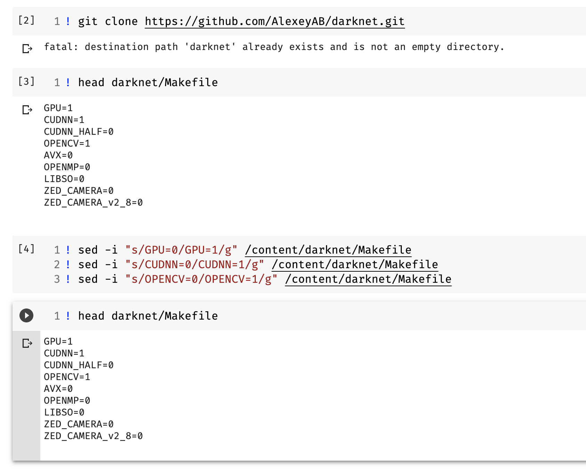
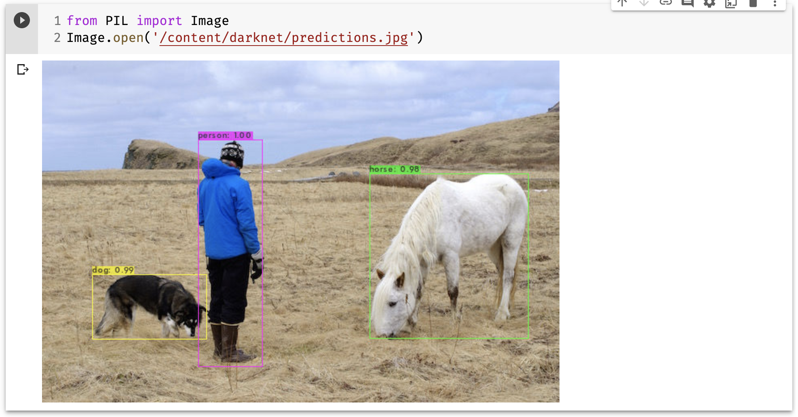

# Yolo_v4
# Yolo_v4 with colab

# 顯示 gpu 資訊 

! nvidia-smi

# 下載及調整 darknet 框架以及參數

! git clone https://github.com/AlexeyAB/darknet.git

GPU 0 ->1

cudnn 0 ->1

opencv 0 ->1

### 參數說明

1. GPU=1 調用 GPU CUDA
2. CUDNN=1 調用 cuDNN v5-v7 加速訓練
3. CUDNN_HALF=1 調用 Tensor Cores (適用於 Titan V / Tesla V100 / DGX-2 and later) 偵測加速 3 倍, 訓練加速 2 倍
4. OPENCV=1 調用 OpenCV 3.x/2.4.x - 用於攝影機偵測用

# 編譯 YOLOv4

# 下載權重 

! gdown https://drive.google.com/uc?id=1cewMfusmPjYWbrnuJRuKhPMwRe_b9PaT

# 使用 YOLOv4 偵測辨識物件

